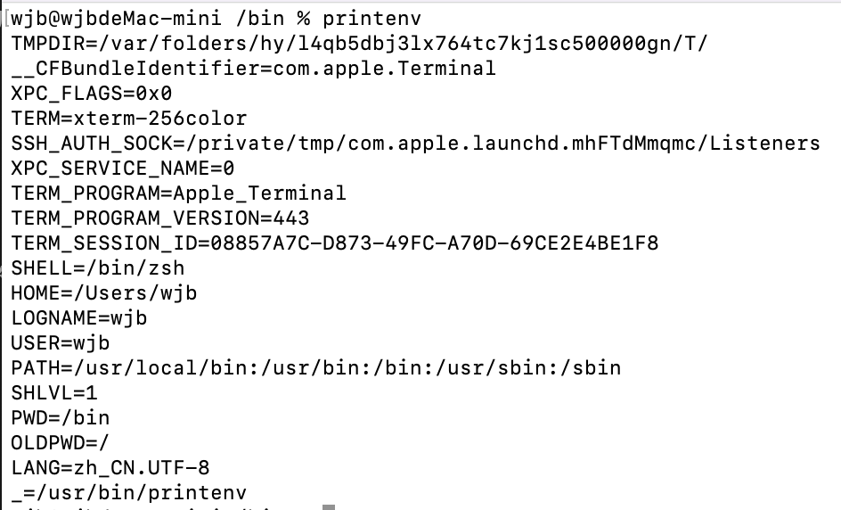
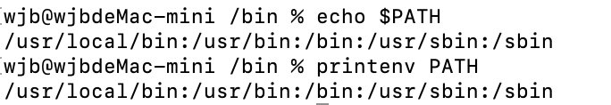

# learn-mac-system-path

用了Mac已经多年了，对于Mac的一些常用命令也都熟记于心。

有时会遇到一些令人费解的问题，所以今天好好研究并记录一下Mac内部的一些环境变量。

# 一、什么是环境变量

 

Mac电脑上运行的操作系统（MacOS）实际上就是一个巨大的程序，这个程序上自带一些变量。这些默认自带的变量就是环境变量。

就和下面这一段简单的JS程序一样，仅仅是操作系统这个大程序里面附带的一个变量而已。

```js
let path = `/Users/wu/`;
```

每个用户登录系统后，都会有一个专用的运行环境。通常每个用户默认的环境都是相同的，这个默认环境实际上就是一组环境变量的定义。

# 二、如何查看环境变量

1. 在终端使用printenv命令，会一次性列出所有环境变量的建值对，如下所示：

```js
VAR1=value1
VAR2=value1
...
```



2. 在终端通过给printenv命令加上环境变量名参数，只查看指定的环境变量的值；或者使用 echo $VAR 命令查看指定环境变量的值

```js
printenv VAR
echo $VAR
```



# 三、环境变量在哪里配置

## 3.1 ```/etc/profile``` 文件

```/etc/profile```文件是一个 Shell 脚本文件，同时也是一个全局配置文件，所有用户登录时都会执行一次这个脚本，在这里修改的内容是对所有用户起作用的。 

```shell
# System-wide .profile for sh(1)

if [ -x /usr/libexec/path_helper ]; then
	eval `/usr/libexec/path_helper -s`
fi

if [ "${BASH-no}" != "no" ]; then
	[ -r /etc/bashrc ] && . /etc/bashrc
fi
```
 
* ```# System-wide .profile for sh(1)``` 这一行是一个注释，说明这是一个全局的 .profile 文件，适用于 sh(1)（即 Bourne shell 或者兼容的 shell，如 Bash）

* ```第一个if```是用来检测对应路径是否存在path_helper的可执行脚本。如果有，则运行这个脚本。

* ```第二个if```用来判断当前Shell是否是Bash，并且如果确认是Bash，就运行/etc/bashrc文件。